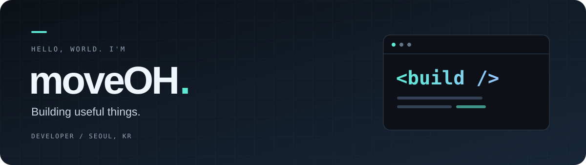

  

  <strong>사용자에게 필요한 것을, 코드로 만듭니다.</strong> 
  My goal is to develop solutions for customers.

  

 

### 01 / About

안녕하세요, **moveOH**입니다. 🇰🇷 
사용자를 위한 솔루션을 만드는 것을 목표로 개발하고 있습니다.

 

### 02 / Projects

| 프로젝트 | 소개 |
| :--- | :--- |
| **[Bushnavi Tournament Manager ↗](https://github.com/moveoh1004/Bushnavi-Tournament-Manager)** | Bushnavi 사용자의 대회 등록을 더 편리하게 만드는 앱 |
| **[hol-ddak ↗](https://github.com/moveoh1004/hol-ddak)** | 카드 목록 탐색부터 덱 제작, 조회와 공유까지 |

 

### 03 / Code & Tools

  
  
  
  

 

---

작은 불편함에서 시작해, 쓸모 있는 결과로.

