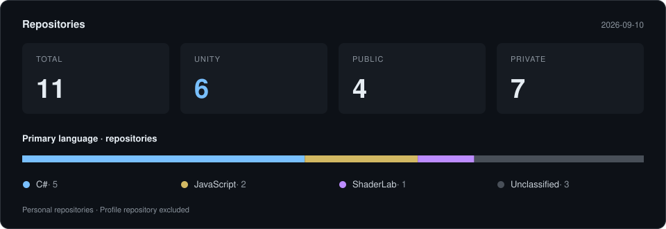

# moveOH

[Repositories ↗](https://github.com/moveoh1004?tab=repositories)

2026-09-10 기준 수동 집계 · 개인 소유 저장소만 포함 · 프로필 저장소 제외 
Unity는 ProjectSettings/ProjectVersion.txt 존재 여부로 판별하며 저장소당 1개로 집계합니다. 
언어 분포는 GitHub의 저장소별 주 언어 기준입니다. 조직 저장소는 포함하지 않습니다.
