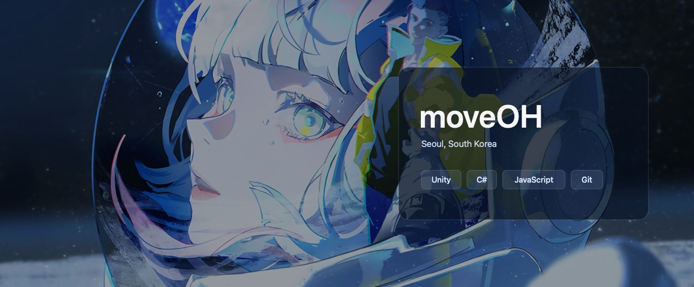

  

<!-- steam:start -->

<h3>Steam</h3>

<a href="https://steamcommunity.com/id/moveOH/">moveOH ↗</a>

<h4>Recently Played</h4>
<table width="700"><tr>
<td align="center" valign="top" width="140"> <strong>Blender</strong> 43 hrs </td>
<td align="center" valign="top" width="140"> <strong>Grand Theft Auto V Legacy</strong> 198 hrs </td>
<td align="center" valign="top" width="140"> <strong>PUBG: BATTLEGROUNDS</strong> 610 hrs </td>
<td align="center" valign="top" width="140"> <strong>Yu-Gi-Oh!  Master Duel</strong> 826 hrs </td>
<td align="center" valign="top" width="140"> <strong>Overwatch®</strong> 2.1 hrs </td>
</tr></table>

<h4>Most Played · Top 5</h4>
<table width="700"><tr>
<td align="center" valign="top" width="140"> <strong>Eternal Return</strong> 1,182.9 hrs </td>
<td align="center" valign="top" width="140"> <strong>Yu-Gi-Oh!  Master Duel</strong> 825.9 hrs </td>
<td align="center" valign="top" width="140"> <strong>PUBG: BATTLEGROUNDS</strong> 610.1 hrs </td>
<td align="center" valign="top" width="140"> <strong>Yu-Gi-Oh! Duel Links</strong> 454.4 hrs </td>
<td align="center" valign="top" width="140"> <strong>Tom Clancy&#x27;s Rainbow Six Siege</strong> 417.5 hrs </td>
</tr></table>

Public Steam data · Total playtime · 2026-11-12 UTC

<!-- steam:end -->

<!-- bushi:start -->

<h3>Tournament Record</h3>

<a href="https://www.en.bushi-navi.com/">Bushi Navi ↗</a>

 &nbsp;  &nbsp; 

Best Relative Finish

<h4>World Grand Prix 25-26 - South Korea</h4>

 &nbsp; 

2026-08-22 · hOCG 

<h4>Recent Tournaments</h4>
<table width="540">
<tr><td align="center" valign="top" width="270"> <strong>Monthly · Palworld OFFICIAL CARD GAME - November 2026 Shop Tournament</strong> 2026-11-05 · PalworldOCG Japanese  </td><td align="center" valign="top" width="270"> <strong>Palworld OFFICIAL CARD GAME - 目覚めし伝説 発売記念大会</strong> 2026-11-01 · PalworldOCG Japanese  </td></tr>
<tr><td align="center" valign="top" width="270"> <strong>Monthly · Shop Tournament</strong> 2026-10-28 · hOCG  </td><td align="center" valign="top" width="270"> <strong>Monthly · Shop Tournament</strong> 2026-10-25 · hOCG  </td></tr>
</table>

How results are counted

Completed, attended event entries only; canceled, waitlisted and absent entries excluded. Field size comes from unique standings entries, not venue capacity; team events count teams. Best relative finish = lowest rank / field size; ties favor the larger field. Missing or grouped standings are excluded from this comparison. This is a profile metric, not an official rating. Updated 2026-11-12 UTC

<!-- bushi:end -->
